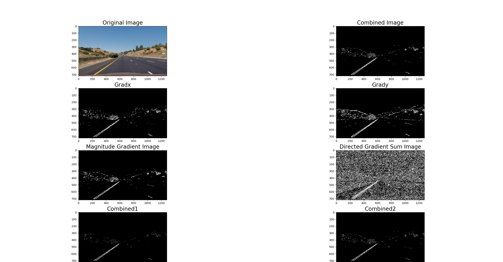
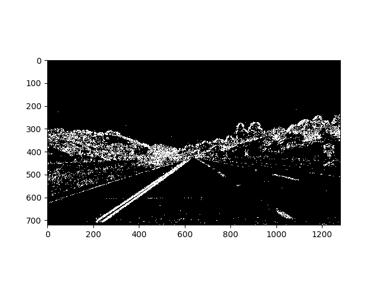

# Self-Driving Car Engineer Nanodegree Program
# *CarND-Advanced-Lane-Lines*

## Introduction 
The goal of this project was to identify the lane of a road under different lightning and curvature conditions. Steps to identify and to mark the lane lines in a movie video included camera calibration, remove distortion of the image, color transformation, edge detection with different filters, warping/unwarping image with lane line detection techniques in-between. Additionally, parameters like curvature of lane lines and the offset of the car with regards to the middle of the road were determined and integrated into the pictures.
The whole functionality was implemented into the file ‘advanced_lane_lines.MASTER.py’.

**Result**:
* Driving the road with marked lines/curves [YouTube video] (https://www.youtube.com/watch?v=gUkvZUEltdM)

## Camera Calibration
For camera calibration, function ‘get_cameracalib’ [l. 12 - 83] was defined. Its purpose is to enable analysis of the calibration and of the pictures and to investigate different calibration methodologies. It includes an optional print out for extended analysis like the following:

The function ‘get_cameracalib’ gets the path of the directory where the files for calibration are. It gives back the camera matrix `mst` and camera distortion `dist`.
For each file in the directory, the function tries to generate the chessboard corners. If this was successful, it integrates the coner into the picture and stores the image and object points in arrays. For the print out, also the filename is collected.
After all images have been analyzed, the camera matrix and distortion are calculated. The matrix and distortion are used during single image or movie processing. Below, a normal image of a chessboard picture and an undistorted chessboard example is shown:

  

From the pictures for calibration, all except calibration1, calibration4 and calibration5 could be used. In all of the three pictures, one or more points of the chessboard were outside the picture. From the remaining pictures, the image ‘calibration3.jpg’ correlated best with the view of the camera and hence was taken for more detailed analysis.

## Lane Detection
For the lane detection, two procedures were defined: One, for analyzing single images and optimizing the flow for lane detection (l. 633 – 772) and a second one, for consecutively working on images of movies (l. 776 – 857). The procedures were called in the main part (l. 859 – 874).
For simplicity reasons, only the algorithm of processing one single image is described in the following. It is implemented similar in the procedure for consecutive images.

### Removal of distortion
The processing of one single image for lane detection started with the calibration of the camera. A sandbox for analysis of options and optimization of parameters (lines 641-644) is followed by a final definition of the camera matrix and distortion. After choosing an appropriate image (l.667-685), the image was cleaned from distortion using the camera matrix and distortion parameters:

Afterwards, another optional sandbox call (l. 693) enabled different edge detection filters and color transformation (l. 341-394). An example looked like the following picture:

 
### Color transforms, edge detection
A function ‘my_grad_color_filter’ (l. 396-456)  based upon several supporting routines (l. 85-105, l. 247-318) calculated different edge detections and color transformations. The function included an optional print out of the intermediate results:

It turned out that color images of the l- and s layer of the HLS color coding work almost best for detection used with an edge detection of `((gradx&grady)or(magnitude&directed))`. The filters of l- and s-layer were combined by or-function. The filtered image was like the following:

### Perspective Transformation
After the filtering, the image had to be unwarped by the function ‘corners_unwarped’ (l. 458-486) to get a bird’s view onto the lane lines. For exact definition of the warp area, an image of a straight road example was printed out and the vanishing point was determined. It was approximately at the coordinates: (640, 420). The picture with the drawn lines looked like the following. The vanishing point is at the crossing of the red lines almost in the middle of the picture:

 

Before unwarping, the area of the lane was cut out of the image to get only the lane lines without roadsides and alike. The cut was defined as a trapezoid with the lower corners of the image as bottom points and the top lying slightly above the vanishing point with the points lying a little bit to the left and right of the lane lines. The exact coordinates were: [(0,0), (555,450), (735,450), (1280,720)]. The cut out was performed by the function ‘cut_region_of_interest’(l. 320-338).
After the cut out, the warping was performed. The destination coordinates were defined by the corners of the image whereas the source points again were defined as a trapezoid. The bottom corners were chosen to be one fourth outside the image to pull in the lane lines and the top line was drawn slightly below the vanishing point. The exact coordinates were: [-320,720], [558,450], [722,450], [1600,720] with the following result of image transformation:

 
### Lane Detection
With the image of a bird’s view, lane line detection was done (l. 731-749). For the first image, the windowing methodology was chosen (‘lineidx_detection_per_window’, l. 488-557). For all other images of the movie, the search area methodology was performed (‘lineidx_detection_per_fit’, l. 559-596). Both algorithms were taken from lecture with slight modifications.

As the windowing methodology was based upon identification of lane line positions using histograms:

the search area method was based upon an already existing polynomial that describes the lane lines of the former image.
The result of both operations was presented below (on the left: windowing methodology, on the right: search area method).

  

In addition, the bird’s view image was used to extract “qualification” data like curvature (‘calc_curvature’, l. 107-131) and distance of the car to the middle of the road (‘calc_xoffset’, l. 133-147). These parameters were used for sanity checks of the lane line detection (‘sanity_check’, l.598-631) which only considered the check of the distance of the lane lines to each other. 

### Lane Area Marking
In a final step, the bird’s view image was filled between the adopted polynomials which represented the two lane lines and unwarped before it was integrated as lane area mark into the real image (‘gen_img_w_marks’, l. 211-244).
At the end, the “qualification” data was inserted into the image resulting in the final image:

 
## Discussion

This implementation could be improved by considering the history for predicting the lane and checking for sanity. The simple algorithm of just checking the distance between the two estimated lines led to more “bumpy” lane marking. It should be improved and could contribute more to the marking.
Another point is the cutting out of the lane lines. A trapezoid was chosen for simplicity reasons. Here, it seems that only the lines shall be cut out to get independent of disturbances in-between the lane lines that could confuse the lane line finding.
As the warping of the area around the vanishing point is very sensitive due to the non-linear transformation (1 picture point variation leads to huge shifts in the transformed picture), a special focus should be put on the transformation of the vanishing point area. Maybe there are specific algorithms, methods (, cameras?) to transform this area more precisely.
